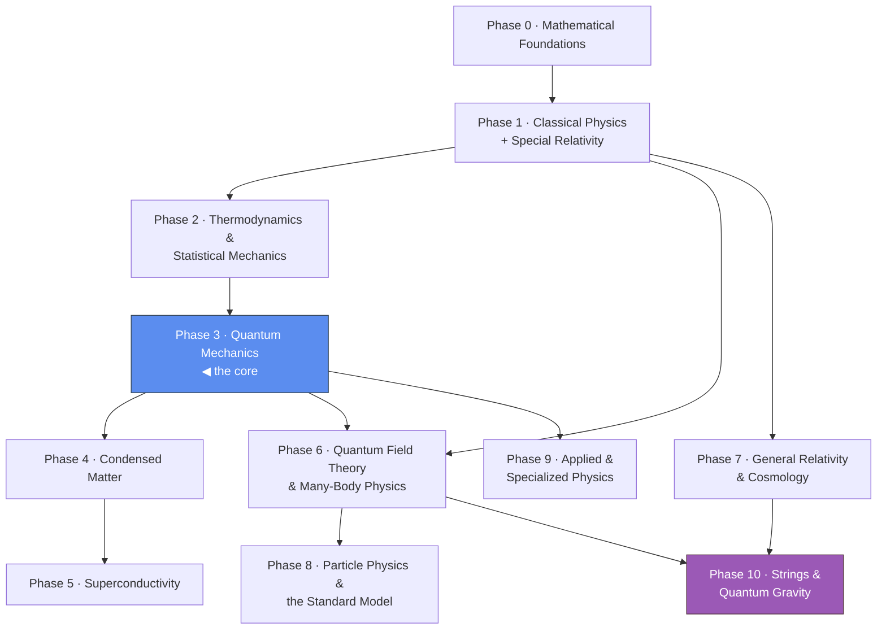
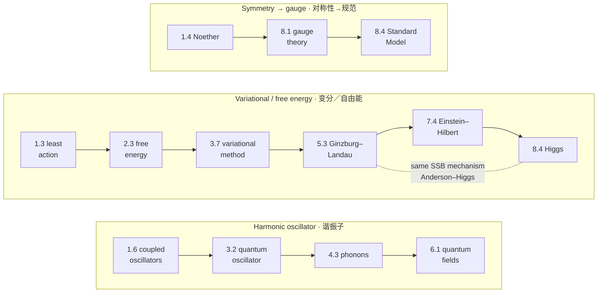

# Physics Study Notes — From Classical Mechanics to the Standard Model
**物理学习笔记 — 从经典力学到标准模型**

A complete self-study curriculum that builds from mathematical foundations all the way to
the frontier of modern physics — **classical mechanics, electromagnetism, special and
general relativity, thermodynamics, the full course of quantum mechanics, condensed matter,
superconductivity, quantum field theory, and the Standard Model of particle physics.**

一套完整的自学课程，从数学基础一路构建到现代物理的前沿——**经典力学、电磁学、狭义与广义相对论、热力学、完整的量子力学课程、凝聚态物理、超导、量子场论，以及粒子物理的标准模型。**

Every note follows one consistent format — **Definition → Demonstration → Application** —
so you always see *what* a concept is, *how* it works on a concrete example, and *where* it
is used later. Modules marked ⭐ are load-bearing for what follows; ⭐⭐ are pivotal.

每篇笔记都遵循统一格式——**定义 → 演示 → 应用**——使你始终清楚一个概念*是什么*、在具体例子上*如何运作*，以及*在何处*被后续使用。标记 ⭐ 的模块是后续内容的重要支柱；⭐⭐ 则是关键枢纽。

The curriculum is organized into **11 phases**, each a directory; each **module** is its own
file. There are **122 modules** in total.

课程组织为 **11 个阶段**，每个阶段对应一个目录；每个**模块**是单独的文件。总共有 **122 个模块**。

---

## How to use these notes · 如何使用这些笔记

- **Follow the [Recommended Learning Path](#recommended-learning-path) below** — it threads
  the 11 phases in dependency order.
- Each phase folder has a **README** with the phase's modules, its **prerequisites**, and a
  **blank-page checkpoint** (self-test). Pass the checkpoint before moving on.
- Each module ends with **prev / next navigation** so you can read a phase straight through.
- Every `*-derivations.md` companion file that has been reviewed carries a green-check
  **✅ Verified** badge near the top. See **[VERIFICATION.md](./VERIFICATION.md)** for the full
  status index and a one-liner that lists only the files changed since they were last verified
  (so re-verification can skip everything still marked ✅).
- Keep the **[bilingual glossary (English ｜ 中文)](./GLOSSARY.md)** open as you read — it lists the key terminology of every phase with Chinese equivalents and short definitions.
- Check **[`CONVENTIONS.md`](./CONVENTIONS.md)** for the unit systems, metric signature, index, and notation conventions used throughout — including the mostly-minus $(+,-,-,-)$ vs mostly-plus $(-,+,+,+)$ signature split between particle physics and general relativity.
- See **[`ROADMAP-THOOFT.md`](./ROADMAP-THOOFT.md)** for how this curriculum maps onto Nobel laureate Gerard 't Hooft's *How to become a GOOD Theoretical Physicist*.
- Read **[`THREAD-GAUGE-THEORY.md`](./THREAD-GAUGE-THEORY.md)** to follow the **gauge principle** as one storyline from Maxwell's $U(1)$ through Yang–Mills to the Standard Model (with the BRST/Faddeev–Popov machinery).
- **Re-derive the ⭐ results by hand** — that's where real understanding comes from.

- **遵循下方的[推荐学习路径](#recommended-learning-path)**——它按依赖顺序串联起 11 个阶段。
- 每个阶段目录都有一个 **README**，列出该阶段的模块、**预备知识**和一份**空白页检查点**（自测）。通过检查点后再继续。
- 每个模块都以**上一个 / 下一个导航**结尾，便于将一个阶段连续读完。
- 阅读时请打开**[双语术语表（英文 ｜ 中文）](./GLOSSARY.md)**——它列出每个阶段的关键术语及其中文对应词和简短定义。
- 查阅**[`CONVENTIONS.md`](./CONVENTIONS.md)**了解全程使用的单位制、度规号差、指标与记号约定——包括粒子物理与广义相对论之间「mostly-minus $(+,-,-,-)$」与「mostly-plus $(-,+,+,+)$」的号差分工。
- 阅读**[`THREAD-GAUGE-THEORY.md`](./THREAD-GAUGE-THEORY.md)**，将**规范原理**作为一条故事线，从麦克斯韦的 $U(1)$ 经杨–米尔斯到标准模型（含 BRST／法捷耶夫–波波夫机制）连贯地读完。
- **亲手重新推导 ⭐ 结果**——真正的理解正源于此。

---

## Recommended Learning Path · 推荐学习路径

> The phase numbers also *are* the learning order — read them 0 → 10 from top to bottom.
> Special Relativity sits right after electromagnetism in Phase 1 (it is the relativistic
> completion of classical electromagnetism), so every prerequisite is satisfied in order:
> relativity before field theory, field theory before the Standard Model, and quantum gravity
> only after both QFT (Phase 6) and general relativity (Phase 7).
>
> 阶段编号*本身*就是学习顺序——自上而下从 0 读到 10。狭义相对论紧接在第 1 阶段的电磁学之后（它是经典电磁学的相对论性完善），因此所有预备知识都按顺序满足：相对论先于场论，场论先于标准模型，量子引力则在量子场论（第 6 阶段）与广义相对论（第 7 阶段）二者之后。

*Arrows are prerequisites; the vertical spine $0\to1\to2\to3\to6\to7$ is the main reading order, with Phases 4–5, 8, and 9 branching off the core. · 箭头表示先修依赖；竖直主干 $0\to1\to2\to3\to6\to7$ 是主要阅读顺序，第 4–5、8、9 阶段从核心分支出去。*

A few **threads worth watching** across the whole curriculum:

- **The harmonic oscillator** (1.6 → 3.2 → 4.3 → 6.1) becomes coupled oscillators, then
  the quantum oscillator, then phonons, then quantum fields.
- **The variational / free-energy principle** (1.3 → 2.3 → 3.7 → 5.3 → 7.4 → 8.4) reappears
  as least action, free-energy minimization, the QM variational method, Ginzburg–Landau
  theory, the Einstein–Hilbert action, and the Higgs mechanism.
- **Symmetry → conservation** (Noether, 1.4) grows into gauge theory and the Standard Model.
- **The complex phase** (0.4) carries interference, supercurrents, and the Josephson effect.
- **Spontaneous symmetry breaking** is *literally the same mechanism* in a superconductor
  (5.3) and in the Higgs sector of particle physics (8.4) — the Anderson–Higgs link.

贯穿整个课程，有几条**值得留意的主线**：

- **谐振子**（1.6 → 3.2 → 4.3 → 6.1）先成为耦合振子，再成为量子振子，然后是声子，最后是量子场。
- **变分 / 自由能原理**（1.3 → 2.3 → 3.7 → 5.3 → 7.4 → 8.4）以最小作用量、自由能极小化、量子力学变分法、金兹堡–朗道理论、爱因斯坦–希尔伯特作用量以及希格斯机制等形式反复出现。
- **对称性 → 守恒**（诺特，1.4）发展为规范理论和标准模型。
- **复数相位**（0.4）携带干涉、超导电流和约瑟夫森效应。
- **自发对称性破缺**在超导体（5.3）和粒子物理的希格斯部分（8.4）中*实际上是同一种机制*——即安德森–希格斯联系。

---

## The Curriculum · 课程总览

### [Phase 0 — Mathematical Foundations](./phase-0-mathematical-foundations/)
The toolkit for everything that follows. · 后续一切内容的工具箱。
| # | Module | |
|---|--------|---|
| 0.1 | [Calculus & Taylor Series](./phase-0-mathematical-foundations/module-0.1-calculus-and-taylor-series.md) | |
| 0.2 | [Linear Algebra](./phase-0-mathematical-foundations/module-0.2-linear-algebra.md) | ⭐ |
| 0.3 | [Differential Equations](./phase-0-mathematical-foundations/module-0.3-differential-equations.md) | |
| 0.4 | [Complex Analysis](./phase-0-mathematical-foundations/module-0.4-complex-analysis.md) | ⭐ |
| 0.5 | [Fourier Analysis & Probability](./phase-0-mathematical-foundations/module-0.5-fourier-analysis-and-probability.md) | ⭐ |
| 0.6 | [Vector Calculus, Tensors & Differential Forms](./phase-0-mathematical-foundations/module-0.6-vector-calculus-tensors-and-differential-forms.md) | |
| 0.7 | [Group Theory & Lie Algebras](./phase-0-mathematical-foundations/module-0.7-group-theory-and-lie-algebras.md) | ⭐ |

### [Phase 1 — Classical Physics](./phase-1-classical-physics/)
Mechanics, electromagnetism, waves & fluids, nonlinear dynamics, and special relativity. · 力学、电磁学、波与流体、非线性动力学，以及狭义相对论。
| # | Module | |
|---|--------|---|
| 1.1 | [Newtonian Mechanics](./phase-1-classical-physics/module-1.1-newtonian-mechanics.md) | |
| 1.2 | [Conservation Laws](./phase-1-classical-physics/module-1.2-conservation-laws.md) | |
| 1.3 | [Lagrangian Mechanics & the Variational Principle](./phase-1-classical-physics/module-1.3-lagrangian-mechanics.md) | ⭐ |
| 1.4 | [Hamiltonian Mechanics, Action & Noether's Theorem](./phase-1-classical-physics/module-1.4-hamiltonian-mechanics-noether.md) | ⭐ |
| 1.5 | [Central-Force Problem & Kepler](./phase-1-classical-physics/module-1.5-central-force-kepler.md) | |
| 1.6 | [Small Oscillations & Coupled Oscillators](./phase-1-classical-physics/module-1.6-small-oscillations-coupled-oscillators.md) | ⭐ |
| 1.7 | [Rigid-Body Dynamics & Non-Inertial Frames](./phase-1-classical-physics/module-1.7-rigid-body-non-inertial-frames.md) | |
| 1.8 | [Electrostatics & Boundary-Value Problems](./phase-1-classical-physics/module-1.8-electrostatics-boundary-value-problems.md) | ⭐ |
| 1.9 | [Magnetostatics](./phase-1-classical-physics/module-1.9-magnetostatics.md) | |
| 1.10 | [Electrodynamics & Maxwell's Equations](./phase-1-classical-physics/module-1.10-electrodynamics-maxwell-equations.md) | ⭐ |
| 1.11 | [Electromagnetic Waves & Radiation](./phase-1-classical-physics/module-1.11-em-waves-radiation.md) | |
| 1.12 | [Optics & Interference](./phase-1-classical-physics/module-1.12-optics-interference.md) | |
| 1.13 | [Special Relativity — Kinematics](./phase-1-classical-physics/module-1.13-special-relativity-kinematics.md) | ⭐ |
| 1.14 | [Relativistic Dynamics & $E = mc^2$](./phase-1-classical-physics/module-1.14-relativistic-dynamics-energy-momentum.md) | ⭐ |
| 1.15 | [Covariant Electromagnetism](./phase-1-classical-physics/module-1.15-covariant-electromagnetism.md) | |
| 1.16 | [Mechanical Waves & Acoustics](./phase-1-classical-physics/module-1.16-mechanical-waves-acoustics.md) | |
| 1.17 | [Fluid Mechanics](./phase-1-classical-physics/module-1.17-fluid-mechanics.md) | |
| 1.18 | [Continuum Mechanics & Elasticity](./phase-1-classical-physics/module-1.18-continuum-mechanics-elasticity.md) | |
| 1.19 | [Nonlinear Dynamics & Chaos](./phase-1-classical-physics/module-1.19-nonlinear-dynamics-chaos.md) | |
| 1.20 | [Canonical Transformations, Hamilton–Jacobi & Action–Angle](./phase-1-classical-physics/module-1.20-canonical-transformations-hamilton-jacobi.md) | ⭐ |
| 1.21 | [Classical Scattering Theory](./phase-1-classical-physics/module-1.21-classical-scattering.md) | |
| 1.22 | [Retarded Potentials, Multipole Radiation & Radiation Reaction](./phase-1-classical-physics/module-1.22-retarded-potentials-radiation-reaction.md) | |
| 1.23 | [Waveguides, Cavity Resonators & Transmission Lines](./phase-1-classical-physics/module-1.23-waveguides-cavities-transmission-lines.md) | |

### [Phase 2 — Thermodynamics & Statistical Mechanics](./phase-2-thermodynamics-statistical-mechanics/)
From heat engines to quantum statistics. · 从热机到量子统计。
| # | Module | |
|---|--------|---|
| 2.1 | [The Laws of Thermodynamics](./phase-2-thermodynamics-statistical-mechanics/module-2.1-laws-of-thermodynamics.md) | |
| 2.2 | [Thermodynamic Potentials & Maxwell Relations](./phase-2-thermodynamics-statistical-mechanics/module-2.2-thermodynamic-potentials.md) | |
| 2.3 | [Free Energy & Phase Transitions](./phase-2-thermodynamics-statistical-mechanics/module-2.3-free-energy-phase-transitions.md) | ⭐ |
| 2.4 | [Classical Statistical Mechanics](./phase-2-thermodynamics-statistical-mechanics/module-2.4-classical-statistical-mechanics.md) | |
| 2.5 | [Quantum Statistics](./phase-2-thermodynamics-statistical-mechanics/module-2.5-quantum-statistics.md) | ⭐ |
| 2.6 | [Quantum Gases & Applications](./phase-2-thermodynamics-statistical-mechanics/module-2.6-quantum-gases-applications.md) | |
| 2.7 | [Kinetic Theory & Transport](./phase-2-thermodynamics-statistical-mechanics/module-2.7-kinetic-theory-and-transport.md) | |
| 2.8 | [Brownian Motion & the Einstein Relation](./phase-2-thermodynamics-statistical-mechanics/module-2.8-brownian-motion-and-the-einstein-relation.md) | |

### [Phase 3 — Quantum Mechanics](./phase-3-quantum-mechanics/)
The core of modern physics. Modules 3.0–3.18. · 现代物理的核心。模块 3.0–3.18。
| # | Module | |
|---|--------|---|
| 3.0 | [Old Quantum Theory & the Photoelectric Effect](./phase-3-quantum-mechanics/module-3.0-old-quantum-theory-and-photoelectric-effect.md) | |
| 3.1 | [The Wave Function](./phase-3-quantum-mechanics/module-3.1-the-wave-function.md) | |
| 3.2 | [Time-Independent Schrödinger Equation](./phase-3-quantum-mechanics/module-3.2-time-independent-schrodinger-equation.md) | ⭐ |
| 3.3 | [Formalism](./phase-3-quantum-mechanics/module-3.3-formalism.md) | ⭐ |
| 3.4 | [Quantum Mechanics in 3D](./phase-3-quantum-mechanics/module-3.4-quantum-mechanics-in-3d.md) | ⭐ |
| 3.5 | [Identical Particles](./phase-3-quantum-mechanics/module-3.5-identical-particles.md) | ⭐ |
| 3.6 | [Time-Independent Perturbation Theory](./phase-3-quantum-mechanics/module-3.6-time-independent-perturbation-theory.md) | |
| 3.7 | [Variational & WKB Methods](./phase-3-quantum-mechanics/module-3.7-variational-and-wkb-methods.md) | |
| 3.8 | [Time-Dependent Perturbation Theory & Scattering](./phase-3-quantum-mechanics/module-3.8-time-dependent-perturbation-theory-and-scattering.md) | |
| 3.9 | [Fundamental Concepts (Sakurai)](./phase-3-quantum-mechanics/module-3.9-fundamental-concepts.md) | |
| 3.10 | [Quantum Dynamics](./phase-3-quantum-mechanics/module-3.10-quantum-dynamics.md) | ⭐ |
| 3.11 | [Angular Momentum, Advanced](./phase-3-quantum-mechanics/module-3.11-angular-momentum-advanced.md) | ⭐ |
| 3.12 | [Symmetry, Identical Particles & Second Quantization](./phase-3-quantum-mechanics/module-3.12-second-quantization.md) | ⭐⭐ |
| 3.13 | [Entanglement, EPR & Bell's Theorem](./phase-3-quantum-mechanics/module-3.13-entanglement-epr-and-bell.md) | ⭐ |
| 3.14 | [Density Matrix & Open Quantum Systems](./phase-3-quantum-mechanics/module-3.14-density-matrix-and-open-quantum-systems.md) | ⭐ |
| 3.15 | [Relativistic Quantum Mechanics (Dirac)](./phase-3-quantum-mechanics/module-3.15-relativistic-quantum-mechanics.md) | ⭐ |
| 3.16 | [Quantum Computation & Information](./phase-3-quantum-mechanics/module-3.16-quantum-computation-and-information.md) | |
| 3.17 | [Quantum Algorithms & Error Correction](./phase-3-quantum-mechanics/module-3.17-quantum-algorithms-and-error-correction.md) | |
| 3.18 | [Quantum Scattering Theory](./phase-3-quantum-mechanics/module-3.18-quantum-scattering-theory.md) | |

### [Phase 4 — Condensed Matter / Solid State](./phase-4-condensed-matter/)
Electrons and phonons in a crystal. Modules 4.1–4.12. · 晶体中的电子与声子。模块 4.1–4.12。
| # | Module | |
|---|--------|---|
| 4.1 | [Electrons and Heat in Solids](./phase-4-condensed-matter/module-4.1-electrons-and-heat-in-solids.md) | |
| 4.2 | [Crystal Structure & Reciprocal Space](./phase-4-condensed-matter/module-4.2-crystal-structure-and-reciprocal-space.md) | ⭐ |
| 4.3 | [Lattice Vibrations & Phonons](./phase-4-condensed-matter/module-4.3-lattice-vibrations-and-phonons.md) | ⭐ |
| 4.4 | [Electrons in a Periodic Potential](./phase-4-condensed-matter/module-4.4-electrons-in-a-periodic-potential.md) | ⭐ |
| 4.5 | [Fermi Surface & Electron–Phonon Coupling](./phase-4-condensed-matter/module-4.5-fermi-surface-and-electron-phonon-coupling.md) | ⭐ |
| 4.6 | [Magnetism & Spin Waves](./phase-4-condensed-matter/module-4.6-magnetism-and-spin-waves.md) | ⭐ |
| 4.7 | [Semiconductor Physics](./phase-4-condensed-matter/module-4.7-semiconductor-physics.md) | ⭐ |
| 4.8 | [The Quantum Hall Effect](./phase-4-condensed-matter/module-4.8-quantum-hall-effect.md) | ⭐ |
| 4.9 | [Topological Matter & Berry Phase](./phase-4-condensed-matter/module-4.9-topological-matter-and-berry-phase.md) | ⭐ |
| 4.10 | [Landau Fermi-Liquid Theory](./phase-4-condensed-matter/module-4.10-landau-fermi-liquid-theory.md) | ⭐ |
| 4.11 | [Linear Response, Transport & the Kubo Formula](./phase-4-condensed-matter/module-4.11-linear-response-and-transport.md) | |
| 4.12 | [The Hubbard Model & Mott Insulators](./phase-4-condensed-matter/module-4.12-hubbard-model-and-mott-insulators.md) | ⭐ |

### [Phase 5 — Superconductivity](./phase-5-superconductivity/)
Where it all converges. Modules 5.1–5.11. · 一切汇聚之处。模块 5.1–5.11。
| # | Module | |
|---|--------|---|
| 5.1 | [Phenomenology](./phase-5-superconductivity/module-5.1-phenomenology.md) | |
| 5.2 | [London Theory](./phase-5-superconductivity/module-5.2-london-theory.md) | ⭐ |
| 5.3 | [Ginzburg–Landau Theory](./phase-5-superconductivity/module-5.3-ginzburg-landau-theory.md) | ⭐⭐ |
| 5.4 | [The Cooper Problem](./phase-5-superconductivity/module-5.4-the-cooper-problem.md) | ⭐ |
| 5.5 | [BCS Theory](./phase-5-superconductivity/module-5.5-bcs-theory.md) | ⭐⭐ |
| 5.6 | [Tunneling & the Gap](./phase-5-superconductivity/module-5.6-tunneling-and-the-gap.md) | |
| 5.7 | [Type II Superconductors & Vortices](./phase-5-superconductivity/module-5.7-type-ii-superconductors-and-vortices.md) | ⭐ |
| 5.8 | [Josephson Effects](./phase-5-superconductivity/module-5.8-josephson-effects.md) | ⭐ |
| 5.9 | [Unconventional & High-$T_c$ Superconductors](./phase-5-superconductivity/module-5.9-unconventional-and-high-tc-superconductors.md) | |
| 5.10 | [Bogoliubov–de Gennes & Andreev Reflection](./phase-5-superconductivity/module-5.10-bogoliubov-de-gennes-and-andreev-reflection.md) | |
| 5.11 | [Topological Superconductivity & Majorana](./phase-5-superconductivity/module-5.11-topological-superconductivity-and-majorana.md) | |

### [Phase 6 — Quantum Field Theory & Many-Body Physics](./phase-6-quantum-field-theory/)
The modern research toolkit; the shared language of condensed matter and particle physics. · 现代研究工具箱；凝聚态物理与粒子物理的共同语言。
| # | Module | |
|---|--------|---|
| 6.1 | [Second Quantization & the Many-Body Problem](./phase-6-quantum-field-theory/module-6.1-second-quantization.md) | ⭐ |
| 6.2 | [Green's Functions & Propagators](./phase-6-quantum-field-theory/module-6.2-greens-functions.md) | ⭐ |
| 6.3 | [Feynman Diagrams & Perturbation Theory](./phase-6-quantum-field-theory/module-6.3-feynman-diagrams.md) | |
| 6.4 | [Path Integrals & Field Theory](./phase-6-quantum-field-theory/module-6.4-path-integrals.md) | ⭐ |
| 6.5 | [Canonical Quantization of Fields](./phase-6-quantum-field-theory/module-6.5-canonical-quantization.md) | ⭐ |
| 6.6 | [Renormalization & the Renormalization Group](./phase-6-quantum-field-theory/module-6.6-renormalization.md) | ⭐⭐ |
| 6.7 | [Exactly Solvable Models & Long-Range Order](./phase-6-quantum-field-theory/module-6.7-exactly-solvable-models-and-long-range-order.md) | |
| 6.8 | [Scattering, the S-Matrix & LSZ Reduction](./phase-6-quantum-field-theory/module-6.8-scattering-s-matrix-and-lsz.md) | |
| 6.9 | [Anomalies & Non-Perturbative QFT](./phase-6-quantum-field-theory/module-6.9-anomalies-and-nonperturbative-qft.md) | |
| 6.10 | [Spontaneous Symmetry Breaking & Goldstone's Theorem](./phase-6-quantum-field-theory/module-6.10-spontaneous-symmetry-breaking-and-goldstone.md) | |
| 6.11 | [Effective Field Theory & the Wilsonian RG](./phase-6-quantum-field-theory/module-6.11-effective-field-theory-and-the-renormalization-group.md) | |
| 6.12 | [Finite-Temperature Field Theory (Matsubara)](./phase-6-quantum-field-theory/module-6.12-finite-temperature-field-theory.md) | |
| 6.13 | [Conformal Field Theory](./phase-6-quantum-field-theory/module-6.13-conformal-field-theory.md) | ⭐ |

### [Phase 7 — General Relativity & Cosmology](./phase-7-general-relativity-and-cosmology/)
Gravity as the geometry of spacetime. · 引力即时空的几何。
| # | Module | |
|---|--------|---|
| 7.1 | [The Equivalence Principle & Curved Spacetime](./phase-7-general-relativity-and-cosmology/module-7.1-equivalence-principle-and-curved-spacetime.md) | ⭐ |
| 7.2 | [Tensors, the Metric & Curvature](./phase-7-general-relativity-and-cosmology/module-7.2-tensors-metric-and-curvature.md) | ⭐ |
| 7.3 | [Geodesics & the Motion of Particles](./phase-7-general-relativity-and-cosmology/module-7.3-geodesics-and-motion-of-particles.md) | |
| 7.4 | [Einstein's Field Equations](./phase-7-general-relativity-and-cosmology/module-7.4-einsteins-field-equations.md) | ⭐⭐ |
| 7.5 | [Black Holes & Gravitational Waves](./phase-7-general-relativity-and-cosmology/module-7.5-black-holes-and-gravitational-waves.md) | ⭐ |
| 7.6 | [Cosmology](./phase-7-general-relativity-and-cosmology/module-7.6-cosmology.md) | |
| 7.7 | [Tests of GR & Gravitational-Wave Astronomy](./phase-7-general-relativity-and-cosmology/module-7.7-tests-of-gr-and-gravitational-wave-astronomy.md) | |
| 7.8 | [Global Structure & Singularity Theorems](./phase-7-general-relativity-and-cosmology/module-7.8-global-structure-and-singularity-theorems.md) | |

### [Phase 8 — Particle Physics & the Standard Model](./phase-8-particle-physics-and-standard-model/)
The quantum field theory of the fundamental particles and forces. · 基本粒子与基本力的量子场论。
| # | Module | |
|---|--------|---|
| 8.1 | [Symmetries & Gauge Theory](./phase-8-particle-physics-and-standard-model/module-8.1-symmetries-and-gauge-theory.md) | ⭐ |
| 8.2 | [Quantum Electrodynamics (QED)](./phase-8-particle-physics-and-standard-model/module-8.2-quantum-electrodynamics.md) | ⭐ |
| 8.3 | [The Strong Interaction (QCD)](./phase-8-particle-physics-and-standard-model/module-8.3-quantum-chromodynamics.md) | |
| 8.4 | [Electroweak Theory & the Higgs](./phase-8-particle-physics-and-standard-model/module-8.4-electroweak-theory-and-higgs.md) | ⭐⭐ |
| 8.5 | [The Standard Model & Beyond](./phase-8-particle-physics-and-standard-model/module-8.5-standard-model-and-beyond.md) | |
| 8.6 | [Particle Physics & Cosmology](./phase-8-particle-physics-and-standard-model/module-8.6-particle-physics-and-cosmology.md) | |
| 8.7 | [Parity Violation & the Weak Interaction (Lee–Yang)](./phase-8-particle-physics-and-standard-model/module-8.7-parity-violation-and-the-weak-interaction.md) | |
| 8.8 | [The Quark Model & Hadron Spectroscopy](./phase-8-particle-physics-and-standard-model/module-8.8-quark-model-and-hadron-spectroscopy.md) | |
| 8.9 | [Deep Inelastic Scattering & Partons](./phase-8-particle-physics-and-standard-model/module-8.9-deep-inelastic-scattering-and-partons.md) | |
| 8.10 | [Neutrino Physics & Experimental Particle Physics](./phase-8-particle-physics-and-standard-model/module-8.10-neutrino-physics-and-experiment.md) | |

### [Phase 9 — Applied & Specialized Physics](./phase-9-applied-and-specialized-physics/)
The applied/specialized subjects from 't Hooft's roadmap. · 't Hooft 路线图中的应用与专门科目。
| # | Module | |
|---|--------|---|
| 9.1 | [Electronics](./phase-9-applied-and-specialized-physics/module-9.1-electronics.md) | |
| 9.2 | [Atomic & Molecular Physics](./phase-9-applied-and-specialized-physics/module-9.2-atomic-and-molecular-physics.md) | |
| 9.3 | [Nuclear Physics](./phase-9-applied-and-specialized-physics/module-9.3-nuclear-physics.md) | |
| 9.4 | [Plasma Physics](./phase-9-applied-and-specialized-physics/module-9.4-plasma-physics.md) | |
| 9.5 | [Nuclear Reactions & Astrophysics](./phase-9-applied-and-specialized-physics/module-9.5-nuclear-reactions-and-astrophysics.md) | |
| 9.6 | [Quantum Optics & Laser Physics](./phase-9-applied-and-specialized-physics/module-9.6-quantum-optics-and-lasers.md) | |
| 9.7 | [Atoms in External Fields & Precision Spectroscopy](./phase-9-applied-and-specialized-physics/module-9.7-atoms-in-external-fields.md) | |
| 9.8 | [Stellar Structure & Compact Objects](./phase-9-applied-and-specialized-physics/module-9.8-stellar-structure-and-compact-objects.md) | |

### [Phase 10 — Strings & Quantum Gravity](./phase-10-strings-and-quantum-gravity/)
The summit of the roadmap: unifying QFT and general relativity. · 路线图的顶峰：统一量子场论与广义相对论。
| # | Module | |
|---|--------|---|
| 10.1 | [String Theory & Superstrings](./phase-10-strings-and-quantum-gravity/module-10.1-string-theory-and-superstrings.md) | ⭐ |
| 10.2 | [Quantum Gravity & Holography](./phase-10-strings-and-quantum-gravity/module-10.2-quantum-gravity-and-holography.md) | |
| 10.3 | [The AdS/CFT Correspondence & Black-Hole Information](./phase-10-strings-and-quantum-gravity/module-10.3-ads-cft-and-black-hole-information.md) | ⭐ |

---

## Phase dependency reference · 阶段依赖关系

| Phase · 阶段 | Prerequisites · 预备知识 |
|-------|---------------|
| 0 — Mathematical Foundations | none |
| 1 — Classical Physics | 0 |
| 2 — Thermodynamics & Stat. Mech. | 0, 1 |
| 3 — Quantum Mechanics | 0, 1, 2 |
| 4 — Condensed Matter | 2, 3 |
| 5 — Superconductivity | 2, 3, 4 |
| 6 — Quantum Field Theory | 1 (incl. special relativity), 2, 3 |
| 7 — General Relativity & Cosmology | 0.6, 1.13–1.15 |
| 8 — Particle Physics & Standard Model | 1.13–1.15, 3, 6 |
| 9 — Applied & Specialized Physics | 1, 2, 3 |
| 10 — Strings & Quantum Gravity | 0.7, 6, 7 |

*From the calculus of Module 0.1 to the Higgs mechanism of Module 8.4, every step is a
prerequisite for the next. Pass each blank-page checkpoint and you will genuinely understand
how the pieces of modern physics fit together.*

*从模块 0.1 的微积分到模块 8.4 的希格斯机制，每一步都是下一步的预备知识。通过每一份空白页检查点，你将真正理解现代物理的各个部分如何拼合在一起。*
