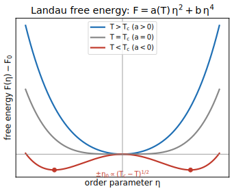

# Module 2.3 — Free Energy & Phase Transitions ⭐
**模块 2.3 — 自由能与相变 ⭐**

> **Phase 2 — [Thermodynamics & Statistical Mechanics](./README.md)** · Format: Definition → Demonstration → Application
> **第 2 阶段 — 热力学与统计力学 · 格式：定义 → 演示 → 应用**
>
> 📐 **Full step-by-step proofs:** [Derivations · 推导](./module-2.3-derivations.md)

---

## 1. First- and Second-Order Transitions · 一阶与二阶相变

**Definition.** A system at fixed $T$ and $P$ minimizes its Gibbs free energy $G$ (Module 2.2). A **phase transition** occurs when competing phases become degenerate in $G$, and the equilibrium state changes discontinuously or continuously in some property. Transitions are classified by behavior at the transition temperature $T_c$:

**定义。** 在固定 $T$ 和 $P$ 下，系统使吉布斯自由能 $G$（模块 2.2）极小。当竞争相在 $G$ 上简并时发生**相变**，平衡态在某些性质上发生非连续或连续的变化。相变按其在转变温度 $T_c$ 处的行为分类：

- **First-order**: $G$ is continuous but its first derivatives ($S = -\left(\frac{\partial G}{\partial T}\right)_P$ and $V = \left(\frac{\partial G}{\partial P}\right)_T$) are discontinuous. A latent heat $L = T_c\, \Delta S$ is released, and the two phases coexist. Examples: melting, boiling.
- **Second-order (continuous)**: $G$ and its first derivatives are continuous, but second derivatives (heat capacity $C$, compressibility $\kappa$, susceptibility $\chi$) diverge. No latent heat; no phase coexistence. Examples: the ferromagnetic Curie point, the superfluid transition, the superconducting transition.

- **一阶相变**：$G$ 连续，但其一阶导数（$S = -\left(\frac{\partial G}{\partial T}\right)_P$ 和 $V = \left(\frac{\partial G}{\partial P}\right)_T$）不连续。释放潜热 $L = T_c\, \Delta S$，两相共存。例子：熔化、沸腾。
- **二阶（连续）相变**：$G$ 及其一阶导数连续，但二阶导数（热容 $C$、压缩率 $\kappa$、磁化率 $\chi$）发散。无潜热；无两相共存。例子：铁磁居里点、超流转变、超导转变。

**Demonstration.** Near a first-order transition, plotting $G(T)$ for each phase shows two branches that cross at $T_c$; the equilibrium state jumps between branches, causing the discontinuity in entropy (hence latent heat). At a second-order transition, the branches merge tangentially, so $S$ is continuous but $C = T\left(\frac{\partial S}{\partial T}\right)_P$ diverges — this shows up as a cusp or lambda anomaly in heat capacity measurements.

**演示。** 在一阶相变附近，画出每相的 $G(T)$ 可见两条在 $T_c$ 处相交的分支；平衡态在两分支之间跳跃，导致熵不连续（即潜热）。在二阶相变处，两条分支切向相合，故 $S$ 连续但 $C = T\left(\frac{\partial S}{\partial T}\right)_P$ 发散——这在热容测量中表现为尖峰或 $\lambda$ 异常。

**Application.** The classification determines experimental signatures: calorimetry detects latent heat for first-order transitions; diverging susceptibility and power-law scaling of thermodynamic quantities near $T_c$ signal second-order transitions, and their critical exponents are the central objects of renormalization-group theory (Module 6.6).

**应用。** 分类决定了实验特征：量热法检测一阶相变的潜热；$T_c$ 附近发散的磁化率和热力学量的幂律标度标志着二阶相变，其临界指数是重正化群理论（模块 6.6）的核心研究对象。

---

## 2. Landau Theory and the Order Parameter · 朗道理论与序参量

**Definition.** Landau theory provides a unified framework for second-order (and weakly first-order) transitions by expanding the free energy as a power series in an **order parameter** $\eta$, a field that is zero in the disordered phase and non-zero in the ordered phase (e.g., magnetization $M$ for a ferromagnet, superfluid density $\psi$ for a superfluid). Symmetry constrains which powers appear. For a system with $\eta \to -\eta$ symmetry (even powers only):

**定义。** 朗道理论通过将自由能展开为**序参量** $\eta$ 的幂级数，为二阶（及弱一阶）相变提供了统一框架。$\eta$ 是一个在无序相中为零、在有序相中非零的场（例如，铁磁体的磁化强度 $M$，超流体的超流密度 $\psi$）。对称性约束了哪些幂次项可以出现。对于具有 $\eta \to -\eta$ 对称性的系统（仅含偶次项）：

$$ F(T, \eta) = F_0 + a(T)\, \eta^2 + b\, \eta^4 + \dots $$

with $b > 0$ for stability and $a(T) = a_0(T - T_c)$ changing sign at $T_c$ ($a_0 > 0$). Minimizing $\partial F/\partial \eta = 0$ gives:

其中 $b > 0$ 保证稳定性，$a(T) = a_0(T - T_c)$ 在 $T_c$ 处改变符号（$a_0 > 0$）。对 $\partial F/\partial \eta = 0$ 极小化得：

- $T > T_c$: $a > 0$, unique minimum at $\eta = 0$ (disordered phase).
- $T < T_c$: $a < 0$, double-well with minima at $\eta = \pm\sqrt{-a/2b} \propto (T_c - T)^{1/2}$.

- $T > T_c$：$a > 0$，唯一极小值在 $\eta = 0$（无序相）。
- $T < T_c$：$a < 0$，双势阱，极小值在 $\eta = \pm\sqrt{-a/2b} \propto (T_c - T)^{1/2}$。

**Demonstration.** The mean-field critical exponent for the order parameter is $\beta = 1/2$ from $\eta \propto (T_c - T)^{1/2}$. The heat capacity has a discontinuity $\Delta C = a_0^2/(2b)$ at $T_c$ with no latent heat, confirming the second-order character. Including a symmetry-breaking external field $h$ adds a term $-h\eta$, giving a susceptibility $\chi = (\partial \eta/\partial h)_{h\to 0} \propto |T - T_c|^{-1}$ (exponent $\gamma = 1$ in mean field).

**演示。** 序参量的平均场临界指数由 $\eta \propto (T_c - T)^{1/2}$ 给出 $\beta = 1/2$。热容在 $T_c$ 处有一不连续跳变 $\Delta C = a_0^2/(2b)$ 而无潜热，证实了二阶相变的性质。引入对称性破缺外场 $h$ 时，增加一项 $-h\eta$，给出磁化率 $\chi = (\partial \eta/\partial h)_{h\to 0} \propto |T - T_c|^{-1}$（平均场中指数 $\gamma = 1$）。

If $b < 0$ (with a stabilizing $c\, \eta^6$ term), the potential develops a secondary minimum before $a = 0$ is reached, and the transition becomes first-order — the order parameter jumps discontinuously at $T_c$. This explains how Landau theory captures both orders of transition in a single framework.

若 $b < 0$（加入稳定项 $c\, \eta^6$），势在 $a = 0$ 之前便出现次极小值，相变变为一阶——序参量在 $T_c$ 处不连续地跳变。这说明朗道理论在单一框架内同时捕捉了两种阶次的相变。

**Application.** Landau theory is a template that recurs throughout condensed-matter and particle physics:

**应用。** 朗道理论是一个在凝聚态物理和粒子物理中反复出现的模板：

- **Ginzburg–Landau theory** (Module 5.3) identifies $\eta$ with the complex superconducting order parameter $\psi$ and adds gradient and electromagnetic coupling terms — giving the full phenomenology of type-I and type-II superconductors.
- The **Higgs mechanism** (Module 8.4) is the relativistic field-theory version of the same double-well potential: the Mexican-hat potential for a complex scalar field, with the Goldstone direction becoming the longitudinal gauge boson.
- **Renormalization group** (Module 6.6) explains why mean-field exponents ($\beta = 1/2$, $\gamma = 1$) are wrong near $T_c$ in low dimensions: fluctuations in $\eta$, ignored by the saddle-point minimization, become dominant and shift the exponents to universal, dimension-dependent values.

- **金兹堡–朗道理论**（模块 5.3）将 $\eta$ 等同于复数超导序参量 $\psi$，并加入梯度项和电磁耦合项——给出第 I 类和第 II 类超导体的完整唯象描述。
- **希格斯机制**（模块 8.4）是同一双势阱势的相对论性场论版本：复标量场的墨西哥帽势，其戈德斯通方向成为纵向规范玻色子。
- **重正化群**（模块 6.6）解释了为什么平均场指数（$\beta = 1/2$，$\gamma = 1$）在低维的 $T_c$ 附近是错误的：被鞍点极小化所忽略的 $\eta$ 涨落变得占主导地位，并将指数移至普适的、依赖维数的值。

*Landau free energy $F=a(T)\eta^2+b\eta^4$ with $a(T)=a_0(T-T_c)$: a single minimum at $\eta=0$ above $T_c$, developing into a symmetric double well below $T_c$ with $\pm\eta_0\propto(T_c-T)^{1/2}$ — a continuous (second-order) transition. · 朗道自由能：$T_c$ 以上单一极小，以下变为对称双阱，$\pm\eta_0\propto(T_c-T)^{1/2}$，即连续（二阶）相变。*

## Key results · 核心结果

- $F(T, \eta) = F_0 + a(T)\eta^2 + b\eta^4 + \cdots$ — Landau free energy in the order parameter $\eta$ · 朗道自由能
- $a(T) = a_0(T - T_c)$: minimum at $\eta = 0$ above $T_c$, at $\eta \neq 0$ below — symmetry breaking · 对称性破缺
- Continuous (2nd-order) vs latent-heat (1st-order) transitions · 二阶与一阶相变
- Mean-field exponent $\eta \propto (T_c - T)^{1/2}$ — same template as Ginzburg–Landau (5.3) and Higgs (8.4) · 平均场指数,模板复用于 GL 与希格斯

---

## Self-test (blank page) · 自测（空白页）

1. Sketch $F(\eta)$ for the Landau free energy $F = a(T)\eta^2 + b\eta^4$ at $T > T_c$, $T = T_c$, and $T < T_c$. Mark the equilibrium $\eta$ in each case.
2. Show that minimizing $F = a_0(T - T_c)\eta^2 + b\eta^4$ gives $\eta \propto (T_c - T)^{1/2}$ below $T_c$. What is the mean-field exponent $\beta$?
3. Explain in one sentence the physical difference between a first-order and a second-order phase transition. Which has a latent heat?
4. Name two later modules where the Landau free-energy expansion reappears, and identify the order parameter in each case.

**自测（空白页）**

1. 分别在 $T > T_c$、$T = T_c$ 和 $T < T_c$ 时，画出朗道自由能 $F = a(T)\eta^2 + b\eta^4$ 关于 $\eta$ 的草图，并标出每种情况下的平衡 $\eta$。
2. 证明极小化 $F = a_0(T - T_c)\eta^2 + b\eta^4$ 在 $T < T_c$ 时给出 $\eta \propto (T_c - T)^{1/2}$。平均场指数 $\beta$ 是多少？
3. 用一句话解释一阶和二阶相变在物理上的区别。哪一种有潜热？
4. 指出后续哪两个模块中再次出现朗道自由能展开，并分别给出各情况下的序参量。

<strong>Answer key · 参考答案</strong>

**1.** $T>T_c$ ($a>0$): single minimum at $\eta=0$. $T=T_c$ ($a=0$): flat quartic minimum at $\eta=0$. $T<T_c$ ($a<0$): symmetric double well, minima at $\eta=\pm\eta_0$. · $T>T_c$ 单阱,$T<T_c$ 双阱,极小在 $\pm\eta_0$。

**2.** $\partial F/\partial\eta=2a_0(T-T_c)\eta+4b\eta^3=0\Rightarrow\eta^2=\dfrac{a_0(T_c-T)}{2b}$, so $\eta\propto(T_c-T)^{1/2}$ and the mean-field exponent is $\beta=\tfrac12$. · 极小化得 $\eta\propto(T_c-T)^{1/2}$,$\beta=\tfrac12$。

**3.** A first-order transition has a discontinuous order parameter and a latent heat; a second-order transition has a continuous order parameter and no latent heat. The **first-order** one carries the latent heat. · 一阶有潜热(序参量跳变),二阶无潜热(序参量连续)。

**4.** Module 5.3 Ginzburg–Landau (order parameter = superconducting $\psi$) and Module 8.4 the Higgs mechanism (order parameter = Higgs field $\phi$). · 5.3(超导 $\psi$)与 8.4(希格斯 $\phi$)。

---

← Previous: [Module 2.2 — Thermodynamic Potentials & Maxwell Relations](./module-2.2-thermodynamic-potentials.md) · [Phase 2 index](./README.md) · Next: [Module 2.4 — Classical Statistical Mechanics](./module-2.4-classical-statistical-mechanics.md) →
