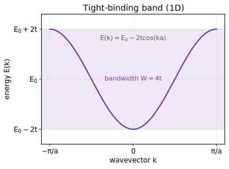

# Module 4.4 — Electrons in a Periodic Potential ⭐
**模块 4.4 — 周期势中的电子 ⭐**

> **Phase 4 — [Condensed Matter / Solid State](./README.md)** · Format: Definition → Demonstration → Application
> **第 4 阶段 — 凝聚态 / 固体物理 · 格式：定义 → 演示 → 应用**
>
> 📐 **Full step-by-step proofs:** [Derivations · 推导](./module-4.4-derivations.md)

---

## 1. Bloch's Theorem & Energy Bands · 布洛赫定理与能带

**Definition.** In a periodic potential, electron eigenstates take the **Bloch form** $\psi_{\mathbf{k}}(\mathbf{r}) = e^{i\mathbf{k}\cdot\mathbf{r}} u_{\mathbf{k}}(\mathbf{r})$, with $u_{\mathbf{k}}$ periodic. Energies organize into **bands** $E_n(\mathbf{k})$ separated by **band gaps**.

**定义。** 在周期势中，电子本征态取**布洛赫形式** $\psi_{\mathbf{k}}(\mathbf{r}) = e^{i\mathbf{k}\cdot\mathbf{r}} u_{\mathbf{k}}(\mathbf{r})$，其中 $u_{\mathbf{k}}$ 是周期函数。能量组织成被**能隙**分隔的**能带** $E_n(\mathbf{k})$。

*The tight-binding band $E(k)=E_0-2t\cos(ka)$: a single band of width $W=4t$ across the Brillouin zone. Filling it controls metal vs insulator. · 紧束缚能带 $E(k)=E_0-2t\cos(ka)$，带宽 $W=4t$；填充情况决定金属还是绝缘体。*

## 2. Two Complementary Pictures · 两种互补图像

**Demonstration.**
- **Nearly-free-electron model**: start from free electrons; the weak periodic potential opens a **gap of size $2|V_{\mathbf{G}}|$** at the Brillouin-zone boundary where states would otherwise be degenerate.
- **Tight-binding model**: start from isolated atomic orbitals; overlap broadens each level into a band, e.g. in 1D **$E(k) = E_0 - 2t \cos(ka)$** ($t$ = hopping amplitude).

**演示。**
- **近自由电子模型**：从自由电子出发；弱周期势在布里渊区边界处（原本态简并的地方）打开**大小为 $2|V_{\mathbf{G}}|$ 的能隙**。
- **紧束缚模型**：从孤立原子轨道出发；轨道重叠将每个能级展宽为能带，例如在一维情况下 **$E(k) = E_0 - 2t \cos(ka)$**（$t$ = 跃迁振幅）。

**Application.** Band filling explains conduction: a **partially filled band → metal**; a **filled band below a gap → insulator/semiconductor**. Superconductivity requires a metal (electrons present at the Fermi level), so this module determines which materials are even candidates, and fixes the normal-state electronic structure that BCS theory builds on.

**应用。** 能带填充解释了导电性：**部分填充的能带 → 金属**；**能隙以下的满带 → 绝缘体/半导体**。超导需要金属（费米能级处存在电子），因此本模块决定了哪些材料甚至具备候选资格，并确定了 BCS 理论所依赖的正常态电子结构。

## Key results · 核心结果

- Bloch's theorem $\psi_k(x) = e^{ikx}u_k(x)$ — eigenstates in a periodic potential · 布洛赫定理
- $E(k) = E_0 - 2t\cos(ka)$ — tight-binding band · 紧束缚能带
- Band gaps open at Brillouin-zone boundaries — metal vs insulator · 带隙区分金属与绝缘体
- Nearly-free vs tight-binding are the two complementary pictures · 近自由与紧束缚两种图像

---

**Self-test (blank page)**

1. State Bloch's theorem: write the Bloch wavefunction $\psi_{\mathbf{k}}(\mathbf{r}) = e^{i\mathbf{k}\cdot\mathbf{r}} u_{\mathbf{k}}(\mathbf{r})$ and explain the role of $u_{\mathbf{k}}$. Why does periodicity of the crystal force this form?
2. In the nearly-free-electron model, a gap of size $2|V_{\mathbf{G}}|$ opens at the Brillouin-zone boundary. Where does this gap come from, and why does only the Fourier component $V_{\mathbf{G}}$ of the potential matter?
3. Write the tight-binding dispersion $E(k) = E_0 - 2t \cos(ka)$ for a 1D chain. What sets the bandwidth, and what is the effective mass near the band bottom?
4. State the rule relating band filling to metallic versus insulating behaviour. Why must superconductivity occur in a metal, and how does this module set the stage for BCS theory?

**自测（空白页）**

1. 写出布洛赫定理：写出布洛赫波函数 $\psi_{\mathbf{k}}(\mathbf{r}) = e^{i\mathbf{k}\cdot\mathbf{r}} u_{\mathbf{k}}(\mathbf{r})$ 并解释 $u_{\mathbf{k}}$ 的含义。为何晶体的周期性迫使波函数取此形式？
2. 在近自由电子模型中，布里渊区边界处打开大小为 $2|V_{\mathbf{G}}|$ 的能隙。这个能隙从何而来？为何只有势的傅里叶分量 $V_{\mathbf{G}}$ 起作用？
3. 写出一维链的紧束缚色散 $E(k) = E_0 - 2t \cos(ka)$。带宽由什么决定？能带底部附近的有效质量是多少？
4. 写出能带填充与金属/绝缘体行为的判据。为何超导必须发生在金属中，以及本模块如何为 BCS 理论铺垫？

<strong>Answer key · 参考答案</strong>

**1.** $\psi_{\mathbf k}(\mathbf r)=e^{i\mathbf k\cdot\mathbf r}u_{\mathbf k}(\mathbf r)$ with $u_{\mathbf k}$ lattice-periodic. Since $[H,T_{\mathbf R}]=0$ for lattice translations, eigenstates are simultaneous eigenstates of $T_{\mathbf R}$ with eigenvalue $e^{i\mathbf k\cdot\mathbf R}$ — forcing the Bloch form. · 平移对称性迫使布洛赫形式,$u_{\mathbf k}$ 具晶格周期。

**2.** At the zone boundary the degenerate plane waves $\mathbf k$ and $\mathbf k-\mathbf G$ are Bragg-coupled by the potential's Fourier component $V_{\mathbf G}$; mixing splits them by $2|V_{\mathbf G}|$. Only $V_{\mathbf G}$ matters because it connects exactly those two degenerate states. · 仅 $V_{\mathbf G}$ 耦合两简并平面波,开 $2|V_{\mathbf G}|$ 带隙。

**3.** $E(k)=E_0-2t\cos(ka)$; bandwidth $W=4t$. Near the bottom $E\approx E_0-2t+ta^2k^2$, so $m^*=\hbar^2/(2ta^2)$. · 带宽 $4t$,带底 $m^*=\hbar^2/2ta^2$。

**4.** A filled band is an insulator, a partially filled band a metal (odd electrons/cell ⟹ metal). Superconductivity needs mobile electrons at $E_F$ — a metal — which BCS then pairs. · 满带绝缘、半满金属;超导需金属态,BCS 配对费米面电子。

---

← Previous: [Module 4.3 — Lattice Vibrations & Phonons](./module-4.3-lattice-vibrations-and-phonons.md) · [Phase 4 index](./README.md) · Next: [Module 4.5 — Fermi Surface & Electron–Phonon Coupling](./module-4.5-fermi-surface-and-electron-phonon-coupling.md) →
