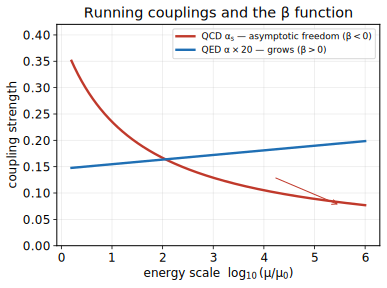

# Module 6.6 — Renormalization & the Renormalization Group ⭐⭐
**模块 6.6 — 重整化与重整化群 ⭐⭐**

> **Phase 6 — [Quantum Field Theory & Many-Body Physics](./README.md)** · Format: Definition → Demonstration → Application
> **第 6 阶段 — 量子场论与多体物理 · 格式：定义 → 演示 → 应用**
>
> 📐 **Full step-by-step proofs:** [Derivations · 推导](./module-6.6-renormalization-derivations.md)

---

## 1. Ultraviolet Divergences, Regularization, and Renormalization · 紫外发散、正规化与重整化

**Definition.** Loop diagrams in QFT involve integrals over all internal momenta $k$, including arbitrarily large $k$ (short distances). These integrals typically diverge: the electron self-energy in QED, $\int d^4k\, G^0(k+p) G^\text{photon}(k)$, diverges logarithmically in the ultraviolet (UV). This is not a failure of the theory but a symptom of naively using a theory at energy scales beyond its domain of validity. Regularization introduces a parameter that makes the integrals finite: dimensional regularization replaces $d^4k \to d^d k$ with $d = 4 - \varepsilon$ ($\varepsilon \to 0$ at the end), making divergences appear as poles in $1/\varepsilon$; a hard momentum cutoff $\Lambda$ makes them appear as powers of $\Lambda$.

**定义。** QFT 中的圈图涉及对所有内部动量 $k$ 的积分，包括任意大的 $k$（短距离）。这些积分通常发散：QED 中的电子自能 $\int d^4k\, G^0(k+p) G^\text{photon}(k)$ 在紫外（UV）对数发散。这不是理论的失败，而是在超出其有效范围的能量尺度上朴素使用理论的症状。正规化引入一个使积分有限的参数：维度正规化将 $d^4k \to d^d k$，其中 $d = 4 - \varepsilon$（最后令 $\varepsilon \to 0$），使发散以 $1/\varepsilon$ 的极点形式出现；硬动量截断 $\Lambda$ 使其以 $\Lambda$ 的幂次出现。

Renormalization absorbs divergences into redefinitions of the physical parameters (mass, charge, field normalization). Write the bare Lagrangian parameters ($m_0, e_0, \phi_0$) in terms of renormalized parameters ($m, e, \phi$) plus counterterms $\delta m, \delta e, \delta Z$ chosen order by order in perturbation theory to cancel the $1/\varepsilon$ poles (or $\Lambda$-dependences). A theory is renormalizable if only finitely many distinct counterterms are needed — equivalently, if all divergences can be absorbed into the parameters already present in $\mathcal{L}$. QED and the Standard Model are renormalizable; gravity (as a quantum field theory) is not.

重整化将发散吸收进物理参数（质量、电荷、场归一化）的重定义中。将裸拉格朗日量参数（$m_0$、$e_0$、$\phi_0$）用重整化参数（$m$、$e$、$\phi$）加上抵消项 $\delta m$、$\delta e$、$\delta Z$ 来表示，这些抵消项逐阶在微扰论中选取以消去 $1/\varepsilon$ 极点（或 $\Lambda$ 依赖性）。若只需有限个不同的抵消项，则理论是可重整的——等价地，若所有发散都能被 $\mathcal{L}$ 中已有参数吸收。QED 和标准模型是可重整的；引力（作为量子场论）则不是。

**Demonstration.** In QED at one loop, the photon propagator acquires a self-energy correction $\Pi(q^2)$ that is logarithmically divergent. After regularization and renormalization, the physical (renormalized) charge $e(\mu)$ depends on the renormalization scale $\mu$: $e^2(\mu) = e^2(\mu_0)/(1 - (e^2(\mu_0)/6\pi^2) \ln(\mu/\mu_0) + \ldots)$. This is the running coupling. As $\mu$ increases (shorter distances, higher energies), $e(\mu)$ increases — QED is asymptotically free in the IR, with the coupling growing toward a Landau pole at exponentially large energies (well beyond any physical scale). In QCD the sign flips (non-Abelian gauge field), giving asymptotic freedom: $e_s(\mu)$ decreases at high $\mu$, justifying perturbation theory at collider energies.

**演示。** 在 QED 一圈阶，光子传播子获得对数发散的自能修正 $\Pi(q^2)$。正规化和重整化后，物理（重整化）电荷 $e(\mu)$ 依赖于重整化尺度 $\mu$：$e^2(\mu) = e^2(\mu_0)/(1 - (e^2(\mu_0)/6\pi^2) \ln(\mu/\mu_0) + \ldots)$。这是跑动耦合常数。随着 $\mu$ 增大（更短距离、更高能量），$e(\mu)$ 增大——QED 在红外是渐近自由的，耦合趋向于指数大能量处的朗道极点（远超任何物理尺度）。在 QCD 中符号翻转（非阿贝尔规范场），给出渐近自由：$e_s(\mu)$ 在高 $\mu$ 时减小，为对撞机能量下的微扰论提供依据。

**Application.** After renormalization, QED yields finite, unambiguous predictions at every order in $e^2$. The electron anomalous magnetic moment $a_e = (g-2)/2 = \alpha/2\pi - 0.328\, \alpha^2/\pi^2 + \ldots$ computed to four loops matches experiment at the level of one part in $10^{12}$, making it the most precisely tested prediction in all of science. The procedure is systematic and algorithmic; Peskin & Schroeder "Introduction to Quantum Field Theory" works through it in full detail.

**应用。** 重整化后，QED 在 $e^2$ 的每一阶给出有限、明确的预言。电子反常磁矩 $a_e = (g-2)/2 = \alpha/2\pi - 0.328\, \alpha^2/\pi^2 + \ldots$ 计算到四圈，与实验在 $10^{12}$ 分之一的水平上吻合，使其成为科学史上经受检验最精确的预言。该程序是系统的、算法性的；Peskin & Schroeder 的 "Introduction to Quantum Field Theory" 详细完整地阐述了这一过程。

---

*Scale-dependent couplings set by the $\beta$ function. $\beta<0$ (QCD) ⟹ the coupling weakens at high energy — asymptotic freedom; $\beta>0$ (QED) ⟹ it grows toward a Landau pole. · 由 $\beta$ 函数决定的跑动耦合:$\beta<0$(QCD)高能渐弱(渐近自由),$\beta>0$(QED)高能增强趋向朗道极点。*

## 2. The Renormalization Group and Universality · 重整化群与普适性

**Definition.** The renormalization group (RG) is not a group in the strict sense but a semigroup of scale transformations: physical observables must be independent of the arbitrary renormalization scale $\mu$, so $\mu\, d/d\mu\, G^{(n)} = 0$ gives the Callan–Symanzik equation. The beta function $\beta(g) = \mu\, dg/d\mu$ encodes how a coupling $g$ flows with scale. Fixed points $\beta(g^*) = 0$ are the universal, scale-invariant theories: free field theory ($g^* = 0$, UV fixed point of asymptotically free theories) and interacting Wilson–Fisher fixed points (in $d = 4 - \varepsilon$ dimensions, $g^* = O(\varepsilon)$).

**定义。** 重整化群（RG）严格意义上并非群，而是尺度变换的半群：物理可观测量必须独立于任意重整化尺度 $\mu$，因此 $\mu\, d/d\mu\, G^{(n)} = 0$ 给出卡兰–西曼兹克方程。$\beta$ 函数 $\beta(g) = \mu\, dg/d\mu$ 编码耦合常数 $g$ 随尺度的流动方式。不动点 $\beta(g^*) = 0$ 是普适的、尺度不变的理论：自由场论（$g^* = 0$，渐近自由理论的紫外不动点）和相互作用的 Wilson–Fisher 不动点（在 $d = 4 - \varepsilon$ 维中，$g^* = O(\varepsilon)$）。

Near a fixed point, perturbations grow as $(\mu/\mu_0)^{\Delta}$ where $\Delta$ is a critical exponent. Relevant perturbations ($\Delta > 0$) dominate at long distances (IR); irrelevant perturbations ($\Delta < 0$) are suppressed. Only finitely many relevant and marginal operators matter for long-distance physics — this is the deep reason why diverse microscopic models sharing the same relevant operators flow to the same fixed point and therefore exhibit the same critical exponents. This is universality.

在不动点附近，扰动按 $(\mu/\mu_0)^{\Delta}$ 增长，其中 $\Delta$ 是临界指数。相关扰动（$\Delta > 0$）在长距离（红外）占主导；无关扰动（$\Delta < 0$）被压制。只有有限个相关和边缘算符对长距离物理有影响——这正是各种具有相同相关算符的微观模型流向同一不动点、因而表现出相同临界指数的深层原因。这就是普适性。

**Demonstration.** The Landau–Ginzburg free energy $F = \int d^d x\, [\tfrac12(\nabla\phi)^2 + \tfrac12 r \phi^2 + u \phi^4]$ (Module 2.3) is a QFT in Euclidean space. Running $u$ and $r$ with the RG scale gives the Wilson–Fisher fixed point at $u^* = \varepsilon/6 + O(\varepsilon^2)$ in $d = 4 - \varepsilon$. Expanding around the fixed point, the correlation length exponent is $\nu = \tfrac12 + \varepsilon/12 + O(\varepsilon^2)$ and $\eta = \varepsilon^2/54 + O(\varepsilon^3)$. These are universal — they apply to the liquid-gas critical point, the Ising ferromagnet, the superfluid transition in ${}^4\text{He}$, and any other system in the same universality class (same symmetry, dimension, and number of order-parameter components). The same RG framework applied to the Ginzburg–Landau theory of superconductivity (Module 5.3) gives the exponents for the superconducting phase transition; fluctuation corrections move it away from mean-field values.

**演示。** 朗道–金兹堡自由能 $F = \int d^d x\, [\tfrac12(\nabla\phi)^2 + \tfrac12 r \phi^2 + u \phi^4]$（模块 2.3）是欧几里得空间中的一个 QFT。随重整化群尺度跑动 $u$ 和 $r$，在 $d = 4 - \varepsilon$ 维中给出 Wilson–Fisher 不动点 $u^* = \varepsilon/6 + O(\varepsilon^2)$。在不动点附近展开，关联长度指数为 $\nu = \tfrac12 + \varepsilon/12 + O(\varepsilon^2)$，$\eta = \varepsilon^2/54 + O(\varepsilon^3)$。这些是普适的——适用于液-气临界点、伊辛铁磁体、${}^4\text{He}$ 中的超流相变以及同一普适类中的任何其他系统（相同的对称性、维度和序参量分量数）。同样的重整化群框架应用于超导的金兹堡–朗道理论（模块 5.3），给出超导相变的临界指数；涨落修正使其偏离平均场值。

**Application.** The RG unifies four apparently unrelated ideas: (i) the removal of UV divergences in QFT, (ii) the emergence of universal critical exponents in statistical mechanics, (iii) the concept of effective field theory (at energy $E$, integrate out degrees of freedom at scales $\gg E$; the result is a renormalized EFT valid below $E$), and (iv) the running of coupling constants measured at colliders. It explains why QED predictions are finite and precise, why an Ising magnet and a liquid near its critical point have identical exponents, and why the large-scale universe can be described without knowing the details of Planck-scale physics. Altland & Simons Ch. 8 and Coleman "Introduction to Many-Body Physics" Ch. 15–16 give complementary condensed-matter treatments; Peskin & Schroeder Part II gives the QFT treatment.

**应用。** 重整化群统一了四个表面上无关的思想：（i）QFT 中紫外发散的消除，（ii）统计力学中普适临界指数的涌现，（iii）有效场论的概念（在能量 $E$ 处，积掉尺度 $\gg E$ 的自由度；结果是在 $E$ 以下有效的重整化有效场论），以及（iv）对撞机测量的耦合常数的跑动。它解释了为什么 QED 预言是有限且精确的，为什么伊辛磁体和临界点附近的液体具有相同的临界指数，以及为什么宏观宇宙可以在不了解普朗克尺度物理细节的情况下加以描述。Altland & Simons 第 8 章和 Coleman 的 "Introduction to Many-Body Physics" 第 15–16 章给出互补的凝聚态处理；Peskin & Schroeder 第 II 部分给出 QFT 处理。

## Key results · 核心结果

- Regularize ($d = 4 - \varepsilon$ or cutoff $\Lambda$) → absorb divergences into renormalized $m, e, \phi$ + counterterms; **renormalizable** = finitely many counterterms · 正规化后将发散吸收进重整化参数与抵消项；可重整＝有限个抵消项
- $\beta(g) = \mu\, dg/d\mu$ — beta function; $\mu\, d/d\mu\, G^{(n)} = 0$ Callan–Symanzik · β 函数与卡兰–西曼兹克方程
- Fixed points $\beta(g^*) = 0$; relevant vs irrelevant operators ⟹ **universality** · 不动点与相关／无关算符给出普适性
- QCD is asymptotically free; QED gives $a_e = (g-2)/2$ to 1 part in $10^{12}$ · QCD 渐近自由；QED 的 $a_e$ 精度达 $10^{-12}$

---

## Self-test (blank page) · 自测（空白页）

1. What is the difference between regularization and renormalization? Give one example of each.
2. Define the beta function $\beta(g)$. What does $\beta(g) > 0$ versus $\beta(g) < 0$ imply about the behavior of the coupling at high energies? Give a physical example of each sign.
3. Two systems — a uniaxial ferromagnet and a liquid near its liquid-gas critical point — have the same critical exponents despite completely different microscopic physics. Explain this universality using the language of RG fixed points and relevant operators.

**自测（空白页）**

1. 正规化与重整化的区别是什么？各举一个例子。
2. 定义 $\beta$ 函数 $\beta(g)$。$\beta(g) > 0$ 与 $\beta(g) < 0$ 分别对高能下耦合常数的行为意味着什么？各给出一个物理例子。
3. 两个系统——单轴铁磁体和液-气临界点附近的液体——尽管微观物理完全不同，却具有相同的临界指数。用重整化群不动点和相关算符的语言解释这种普适性。

<strong>Answer key · 参考答案</strong>

**1.** *Regularization* makes a divergent integral finite by introducing a parameter (a momentum cutoff $\Lambda$, or dimensional regularization $d=4-\varepsilon$). *Renormalization* then absorbs the divergences into redefinitions of the physical parameters (mass, charge, field normalization) plus counterterms. Example: dim. reg. (regularization) + charge renormalization in QED (renormalization). · 正规化使积分有限(截断或维数正规化);重整化将发散吸收进物理参数与抵消项。

**2.** $\beta(g)=\mu\,dg/d\mu$. $\beta>0$: the coupling grows at high energy (QED, heading toward a Landau pole). $\beta<0$: the coupling shrinks at high energy — asymptotic freedom (QCD), which justifies perturbation theory at collider energies. · $\beta>0$ 高能增强(QED),$\beta<0$ 高能渐弱(QCD 渐近自由)。

**3.** Both systems flow under coarse-graining to the *same* RG fixed point (Wilson–Fisher), governed by the same relevant operators — fixed by symmetry, dimensionality, and the number of order-parameter components. Irrelevant microscopic details are washed out, so the long-distance exponents coincide: one universality class. · 两系统流向同一不动点,相关算符相同,无关细节被抹去,故临界指数相同。

---

← Previous: [Module 6.5 — Canonical Quantization of Fields](./module-6.5-canonical-quantization.md) · [Phase 6 index](./README.md) · Next: [Module 6.7 — Exactly Solvable Models & Long-Range Order](./module-6.7-exactly-solvable-models-and-long-range-order.md) →
